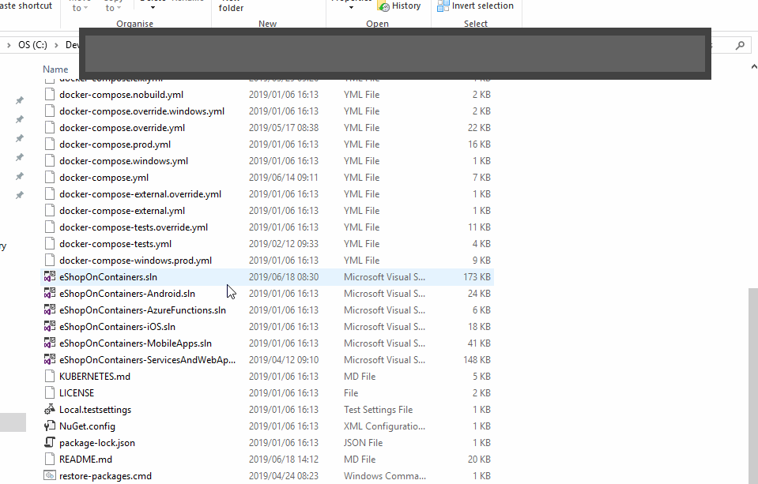

# wox-specifiler
Custom plugin for Wox to lookup specific files
I didn't want to use `Everything` and Wox didn't have a specific plugin to allow me to lookup files that I use regularly with least effort.
So I wrote my own.
Here is an example:

Feel free to clone, use, etc. I'm not responsible for any issues it may cause.